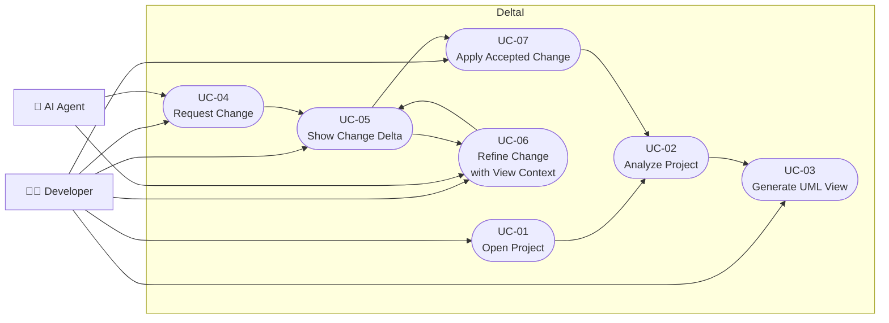

```mermaid
flowchart LR
    Developer["👨‍💻 Developer"]
    Agent["🤖 AI Agent"]

    subgraph DeltaI["DeltaI"]
        UC01(["UC-01<br/>Open Project"])
        UC02(["UC-02<br/>Analyze Project"])
        UC03(["UC-03<br/>Generate UML View"])
        UC04(["UC-04<br/>Request Change"])
        UC05(["UC-05<br/>Show Change Delta"])
        UC06(["UC-06<br/>Refine Change<br/>with View Context"])
        UC07(["UC-07<br/>Apply Accepted Change"])
    end

    Developer --> UC01
    Developer --> UC03
    Developer --> UC04
    Developer --> UC05
    Developer --> UC06
    Developer --> UC07

    Agent --> UC04
    Agent --> UC06

    UC01 --> UC02
    UC02 --> UC03
    UC04 --> UC05
    UC05 --> UC06
    UC06 --> UC05
    UC05 --> UC07
    UC07 --> UC02
```