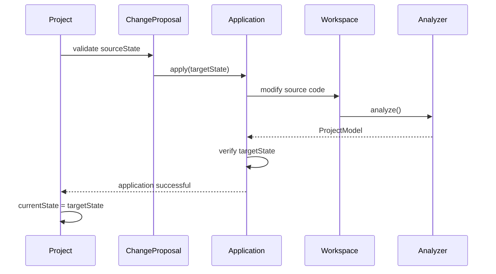
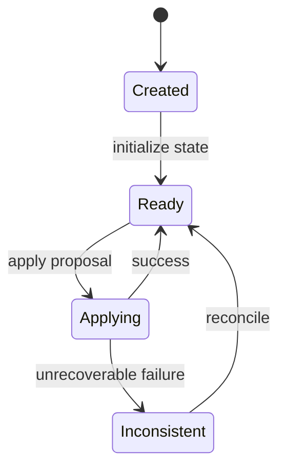
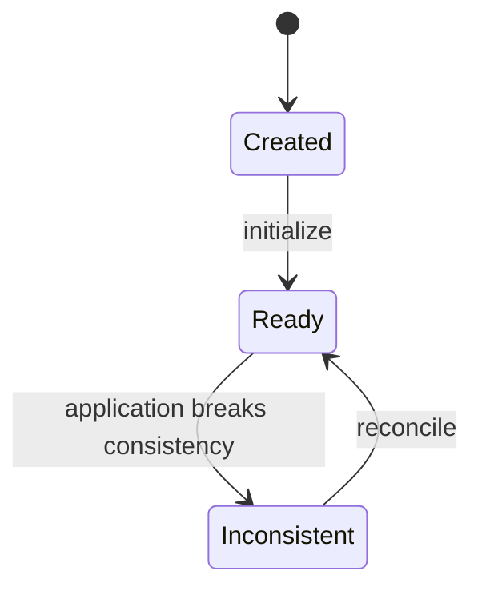

Perfecto. El siguiente paso es definir **la máquina de estados de `Project`**, pero separando claramente el estado del proyecto de los estados de sus propuestas.

## 1. Una observación previa

Después de lo que hemos definido, `Project` **no necesita tantos estados como `ChangeProposal`**.

Un proyecto básicamente tiene:

```text
Project
   │
   └── currentState
```

y una propuesta puede estar siendo aplicada sobre él.

Por tanto, evitaría algo como:

```text
Project
  Created
  Reviewing
  Proposed
  Applying
  Applied
  ...
```

porque mezclaríamos el lifecycle de `Project` con el de `ChangeProposal`.

---

# 2. Estados de `Project`

Propongo inicialmente:

```text
Created
   ↓
Ready
   ↓
Applying
   ├── Ready
   └── Inconsistent
```

### `Created`

El proyecto existe, pero todavía no tenemos un `ProjectState` válido.

Por ejemplo, acabamos de abrir un repositorio.

```text
Project
 └── currentState = null
```

---

### `Ready`

Tenemos un estado válido:

```text
Project
 └── currentState = State₀
```

El proyecto puede:

* recibir Change Requests;
* generar propuestas;
* revisar propuestas;
* aceptar propuestas;
* aplicar propuestas.

---

### `Applying`

Estamos ejecutando una transición:

```text
State₀
  │
  │ Proposal
  ▼
State₁
```

El proyecto está temporalmente en proceso de cambiar de estado.

---

### `Inconsistent`

La aplicación física del cambio ha fallado de tal manera que el estado real del código ya no coincide con el `ProjectState` conocido.

Por ejemplo:

```text
ProjectState₀
     │
     │ apply Proposal
     ▼
Source Code
     │
     │ parcial / error
     ▼
?????
```

Aquí tenemos un problema serio:

```text
ProjectModel != SourceCode
```

El proyecto necesita reconciliación.

---

# 3. State Diagram



Pero hay una cuestión importante.

## ¿Necesitamos realmente `Applying` en `Project`?

Podríamos decir que `Applying` pertenece exclusivamente a `ChangeProposal`:

```text
Proposal
Accepted → Applying → Applied
```

mientras que el `Project` continúa siendo:

```text
Ready
```

hasta que termina la operación.

Eso tiene una ventaja conceptual:

```text
Project
    Ready
      │
      │
      └── Proposal: Applying
```

El proyecto no está realmente en un nuevo estado de dominio mientras se ejecuta la operación.

---

# 4. Prefiero esta alternativa

Creo que para DeltaI es mejor:

```text
Project
    Created
      ↓
    Ready
      ↓
 Inconsistent
```

y que `Applying` sea exclusivamente un estado de `ChangeProposal`.

Entonces:



Esto mantiene una separación muy limpia:

```text
Project
   │
   └── currentState

ChangeProposal
   │
   └── lifecycle
       ├── Generated
       ├── UnderReview
       ├── Accepted
       ├── Applying
       ├── Applied
       ├── Rejected
       └── Superseded
```

---

# 5. Pero aparece una cuestión todavía más importante

Hasta ahora hemos hablado de:

```text
ProjectState
```

como si representase el código real.

Pero realmente tenemos **dos cosas distintas**:

```text
                 Project
                    │
                    ▼
             ProjectState
                    │
                    ▼
              ProjectModel
                    │
                    │
                    │ debería representar
                    ▼
               Source Code
```

¿Qué pasa si el código se modifica **fuera de DeltaI**?

Por ejemplo:

```text
DeltaI
  │
  │ currentState = State₀
  ▼
Code

Developer modifica código manualmente

Code → State₂
```

Ahora:

```text
Project.currentState = State₀
Actual code           = State₂
```

Tenemos una divergencia.

---

# 6. Esto sugiere introducir `WorkspaceState`

Creo que esta es una decisión importante antes de seguir con los diagramas de secuencia.

Podemos distinguir:

### `ProjectState`

El estado semántico que DeltaI reconoce:

```text
ProjectState
    ↓
ProjectModel
```

### `Workspace`

El código físico que existe actualmente:

```text
Workspace
    ↓
Source Files
```

Entonces:

```text
             Project
                │
                ▼
         ProjectState₀
                │
                │ represents
                ▼
          ProjectModel
                │
                │
                ▼
             Workspace
                │
                ▼
           Source Code
```

Y podemos verificar:

```text
analyze(Workspace)
       ↓
   ProjectModel'
```

comparándolo con:

```text
Project.currentState.model
```

---

# 7. Esto resuelve un problema fundamental

La aplicación de una propuesta realmente sería:

```text
Proposal
source = State₀
target = State₁
       │
       ▼
   Application
       │
       ▼
   Workspace
       │
       ▼
  Source Code'
       │
       ▼
    Analyze
       │
       ▼
ProjectModel'
       │
       ▼
verify(ProjectModel', State₁.model)
```

Sólo cuando:

```text
ProjectModel' == State₁.model
```

podemos afirmar:

```text
Proposal = Applied
```

y actualizar:

```text
Project.currentState = State₁
```

---

# 8. El concepto de consistencia

Esto nos permite definir una propiedad fundamental:

```text
ProjectState.model
        ==
Analyze(Workspace)
```

cuando el proyecto está consistente.

Por tanto:

```text
Ready
```

significa conceptualmente:

> El `ProjectState` que DeltaI considera actual corresponde al estado observable del workspace.

Mientras que:

```text
Inconsistent
```

significa:

> DeltaI no puede garantizar que su `ProjectState` represente el código real.

---

# 9. Aplicación de una propuesta

El flujo completo queda mucho más claro:


Fíjate en que **el sequence diagram aparece ahora de forma natural**: no lo usamos para descubrir el dominio, sino para comprobar cómo se materializa una transición que ya hemos definido.

---

# 10. Fallo de aplicación

Y aquí aparece un caso de uso importante:

```text
Proposal
   │
   ▼
Application
   │
   ├── success
   │      ↓
   │    Applied
   │
   └── failure
          ↓
       ¿reversible?
        /       \
       /         \
     yes          no
      │            │
      ▼            ▼
   rollback    Inconsistent
```

Esto nos lleva a una distinción que yo mantendría explícita:

### Application failure

La operación ha fallado pero el workspace sigue representando `State₀`.

Entonces:

```text
Project.currentState = State₀
Project = Ready
Proposal = ApplicationFailed
```

### Inconsistency

La operación ha dejado el workspace en un estado que DeltaI no reconoce.

Entonces:

```text
Project.currentState = State₀
Workspace = Unknown
Project = Inconsistent
```

Y **no debemos cambiar `currentState` a `State₁`**.

---

# 11. Modelo resultante

Ahora tenemos tres niveles diferentes:

```text
┌────────────────────────────────────┐
│             Project                │
│                                    │
│ currentState = State₀              │
└─────────────────┬──────────────────┘
                  │
                  ▼
          ┌───────────────┐
          │ ProjectState  │
          │    State₀     │
          └───────┬───────┘
                  │
                  ▼
          ┌───────────────┐
          │ ProjectModel  │
          └───────┬───────┘
                  │
             represents
                  │
                  ▼
          ┌───────────────┐
          │   Workspace   │
          │ Source Code   │
          └───────────────┘
```

Y una propuesta:

```text
State₀
  │
  │ source
  ▼
Proposal
  │
  │ target
  ▼
State₁
```

se convierte físicamente en:

```text
State₀
  │
  ▼
Application
  │
  ▼
Workspace modification
  │
  ▼
Analyze
  │
  ▼
State₁ verification
  │
  ▼
Project.currentState = State₁
```

---

1. **`Project` tiene un único `currentState`.**
2. **`ProjectState` es inmutable.**
3. **`ChangeProposal` contiene `sourceState` y `targetState`.**
4. **`Applying` pertenece a `ChangeProposal`, no a `Project`.**
5. **El código real vive en un `Workspace`, fuera del dominio puro.**
6. La aplicación de una propuesta debe **verificar el estado resultante** antes de actualizar `Project.currentState`.
7. Si el workspace queda en un estado desconocido, el proyecto pasa a **`Inconsistent`** y necesita reconciliación.
8. La historia completa de estados/propuestas la dejamos abierta para una decisión posterior de persistencia.
