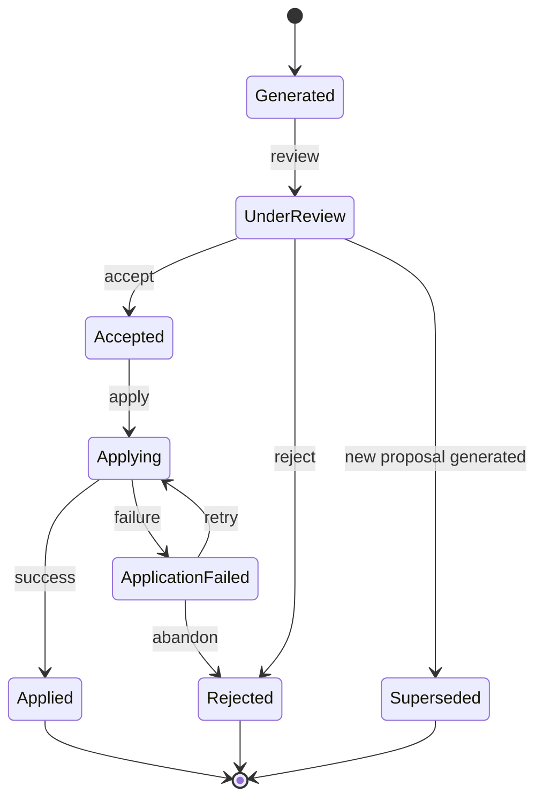

INV-P-001

Una propuesta Generated debe tener:

```text
sourceState
targetState
```

válidos.

INV-P-002

Una propuesta sólo puede ser Accepted desde un estado en el que pueda ser revisada.

```text
UnderReview → Accepted
```

INV-P-003

Aceptar una propuesta no modifica el proyecto.

```text
Accepted
```
no implica:

```text
Project.currentState = targetState
```
INV-P-004

Sólo una aplicación exitosa lleva a:

```text
Applied
```

INV-P-005

Una propuesta Applied debe corresponder al estado que acaba de adoptar el proyecto:

```text
Project.currentState == proposal.targetState
```

INV-P-006

Una propuesta Superseded no puede ser aplicada.

INV-P-007

Una propuesta Rejected no puede ser aplicada.

INV-P-008

Generar una nueva propuesta no modifica las propuestas anteriores.